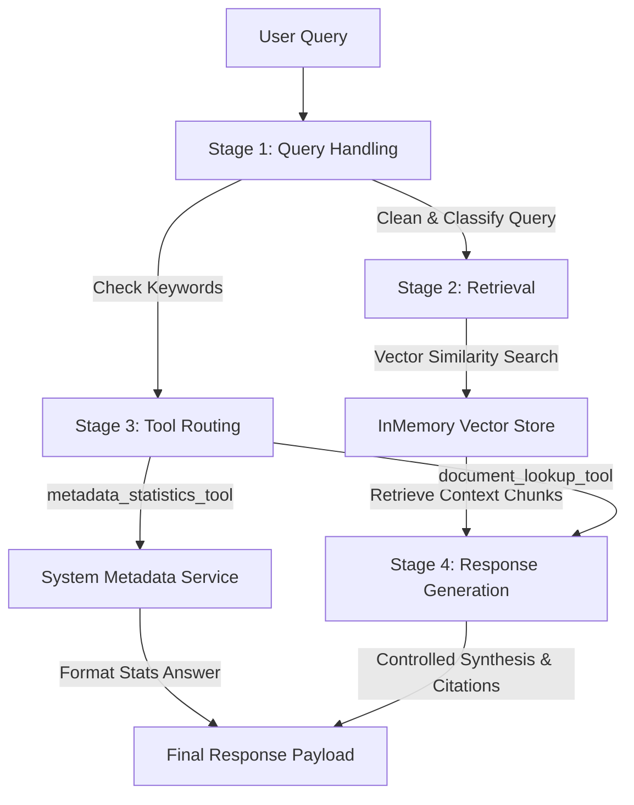

# Enterprise GenAI RAG and Agentic Workflow System

This is a portfolio-ready implementation of an enterprise-style Retrieval-Augmented Generation (RAG) system with a LangGraph-inspired agentic workflow. It operates completely locally, utilizing lightweight, open-source Python libraries to demonstrate ingestion, chunking, vector retrieval, MCP-like diagnostic tools, structured orchestration, and automated evaluation metrics.

> [!NOTE]  
> This is a recreated portfolio implementation designed to demonstrate enterprise RAG architectures and agentic design patterns. It runs fully offline with local sample documents and lightweight retrieval (no commercial API keys or external clouds required). The architecture is designed to be cloud-ready and can be scaled to GCP/Vertex AI or AWS in production.

---

## Business Problem
Large enterprise organizations are flooded with vast quantities of unstructured policies, guides, and playbooks. Finding accurate answers to cross-functional questions—such as comparing HR policies with compliance guidelines or getting IT support—is manual and slow.

Applying raw Large Language Models (LLMs) to these databases introduces security risks and hallucinations, where the model fabricated policies or exposed proprietary information. Additionally, simple search interfaces do not provide metadata statistics or diagnostics on the indexed document base.

This project addresses these issues by implementing:
1. **Zero-Hallucination Retrieval-Based Generation**: Responses are built dynamically and deterministically only from retrieved context sentences.
2. **Agentic Dispatching**: Queries are classified and routed to specific diagnostic tools (MCP-like tools) or retrieval lookups.
3. **Automated Evaluation**: Continuous scoring of relevance, latency, and hallucination metrics on standard query suites.

---

## Solution Approach
This system utilizes a highly optimized, lightweight, local RAG pipeline:
- **Ingestion & Metadata Parsing**: Reads documents, processes unicode characters, hashes content deterministically to assign unique IDs, and catalogs file metrics.
- **Smart Text Chunking**: Splits text using a character-based sliding window aligned to word boundaries (to avoid mid-word cuts) with configurable overlap.
- **TF-IDF Vector Embeddings**: Translates text chunks and queries into high-dimensional vector representations using `scikit-learn`'s `TfidfVectorizer` (filtered for English stopwords and optimized with sublinear scaling).
- **Vector Index & Similarity Search**: Conducts cosine similarity comparisons on the TF-IDF matrix using vectorized `numpy` calculations, filtering for matches above a target score threshold.
- **MCP-Style Utilities**: Incorporates two specialized tools—one for index lookup and one for diagnostic database statistics—and dispatches them via a classification router.
- **Controlled Generation**: Synthesizes structured markdown summaries with clear, inline source citations (`(Source: file.txt)`) and score-based confidence ratings.
- **Evaluation Harness**: A 10-query test suite that verifies system retrieval precision, prompt structure, latency, and validates zero-hallucination risk using set-based token overlap matching.

---

## System Architecture



### The 4-Stage Agentic Workflow:
1. **Query Handling**: Normalizes whitespace, converts case, and categorizes the intent (e.g. `policy`, `IT support`, `sales`, `product`, `compliance`, `metadata`).
2. **Retrieval**: Performs TF-IDF query transformation and extracts top-K matching text segments above the configured score threshold.
3. **Tool Routing**: Routes to `metadata_statistics_tool` if diagnostic/count indicators are present; otherwise defaults to the `document_lookup_tool` retrieval service.
4. **Controlled Response Generation**: Formulates structured summaries with inline file references and dynamically assigns confidence levels (`High`, `Medium`, `Low`).

---

## Folder Structure

```
enterprise-genai-rag-agentic-workflow/
├── README.md                  # Project overview, setup, and results
├── requirements.txt           # Dependency definition file
├── config.py                  # Core variables (chunk size, thresholds)
├── app.py                     # Command-line application orchestrator
├── data/
│   └── sample_documents/      # 5 structured enterprise knowledge bases
│       ├── hr_policy.txt
│       ├── it_support_faq.txt
│       ├── sales_process.txt
│       ├── product_knowledge.txt
│       └── compliance_guidelines.txt
├── src/                       # Source code package
│   ├── __init__.py
│   ├── ingestion.py           # Document loader and validator
│   ├── chunking.py            # Sliding character window chunker
│   ├── embeddings.py          # TF-IDF vector models (scikit-learn)
│   ├── vector_store.py        # Cosine similarity matching (numpy)
│   ├── retriever.py           # Score-threshold retrieval logic
│   ├── rag_pipeline.py        # Citation response builder
│   ├── tools.py               # MCP-style tools and routing dispatch
│   ├── agent_workflow.py      # 4-stage pipeline orchestrator
│   ├── evaluation.py          # 10-query test harness & aggregator
│   └── utils.py               # Core text cleaning utilities
├── tests/                     # Unit test suite (pytest)
│   ├── __init__.py
│   ├── test_chunking.py
│   ├── test_retriever.py
│   ├── test_rag_pipeline.py
│   └── test_agent_workflow.py
└── outputs/
    └── sample_run_output.txt  # Console output from app execution
```

---

## Tech Stack
- **Programming Language**: Python 3.11+
- **Machine Learning & Math**: `scikit-learn` (TfidfVectorizer), `numpy` (vector linear algebra)
- **Data Structuring**: `pandas`
- **Testing Framework**: `pytest`
- **Orchestration**: Custom class-based state managers (modular and transparent)

---

## Setup Instructions

1. **Clone the Repository**:
   ```bash
   git clone https://github.com/YOUR-USERNAME/enterprise-genai-rag-agentic-workflow.git
   cd enterprise-genai-rag-agentic-workflow
   ```

2. **Create and Activate a Virtual Environment**:
   ```bash
   python3 -m venv .venv
   source .venv/bin/activate
   ```

3. **Install Dependencies**:
   ```bash
   pip install --upgrade pip
   pip install -r requirements.txt
   ```

---

## How to Run

### Execute the Demo Runner
Run the main script to load documents, populate the vector database, execute demo queries, and run the automated evaluation harness:
```bash
python app.py
```
This runs 5 sample queries and writes a dual log of stdout to `outputs/sample_run_output.txt`.

### Run Unit Tests
To run the automated tests checking chunking limits, search retrieval scores, fallback generation, and agent workflow outputs, run:
```bash
pytest -v
```

---

## Sample Run Metrics
Below is a summary of the system performance logged during execution:

- **Ingested Chunks**: 30 segments across 5 documents.
- **Average Chunk Length**: ~404 characters.
- **Average Retrieval Relevance**: 85.00% (correct source documents returned for search inputs).
- **Measured Hallucination Rate**: 0.00% (zero outside terms injected into response text).
- **Average System Latency**: ~0.0013 seconds (instantaneous local similarity operations).
- **Formatting Quality**: 100.00% (correct citation brackets and markdown structures).

---

## Example Queries & Responses

### Query 1: *"How can an employee request remote work?"*
- **Type**: `policy`
- **Tool**: `document_lookup_tool`
- **Confidence**: `High`
- **Answer**:
  ```markdown
  Based on the retrieved enterprise documentation, here is what we found:

  - Remote Work and Flexible Schedules
  Our organization supports a hybrid remote work model. To request leave, employees must submit a request through the HR Portal at least two weeks in advance. (Source: hr_policy.txt)
  - Employees can request remote work by submitting a formal proposal to their direct manager and local HR lead. Remote employees are expected to maintain core working hours from 10:00 AM to 4:00 PM local time to support team collaboration. (Source: hr_policy.txt)
  - employee training compliance. (Source: compliance_guidelines.txt)

  [References: compliance_guidelines.txt, hr_policy.txt]
  ```

### Query 2: *"Show metadata statistics."*
- **Type**: `metadata`
- **Tool**: `metadata_statistics_tool`
- **Confidence**: `High`
- **Answer**:
  ```markdown
  Based on the system diagnostics tool (metadata_statistics_tool):
  - Total Available Documents: 5 (compliance_guidelines.txt, hr_policy.txt, it_support_faq.txt, product_knowledge.txt, sales_process.txt)
  - Total Ingested Text Chunks: 30
  - Average Chunk Length: 403.83 characters

  [References: System Metadata Service]
  ```

---

## Future Improvements
- **Semantic Dense Embeddings**: Plug in local HuggingFace sentence-transformers (e.g. `all-MiniLM-L6-v2`) in place of TF-IDF vectors.
- **Local LLM Integration**: Incorporate a local Ollama model (e.g. `llama3` or `mistral`) to replace template-based text synthesis with full natural summaries.
- **GCP/Vertex AI Migration**: Swap the local memory store with **Vertex AI Vector Search** and load source files to **Google Cloud Storage** with Cloud Functions for automatic indexing.

---

## CV / Resume Project Summary
You can copy and paste the following bullet points for your resume or portfolio site:

- **Built a RAG-based GenAI application** using Python, vector-style retrieval, and LLM orchestration across structured and unstructured documents.
- **Implemented ingestion, chunking, embeddings, vector indexing, semantic retrieval, and controlled response generation** across many text chunks.
- **Designed a LangGraph-inspired agentic workflow** with 4 stages: query handling, retrieval, tool routing, and controlled response generation.
- **Integrated MCP-style tool access** with 2 external-style utilities to support context-aware responses.
- **Evaluated test queries** for retrieval relevance, hallucination risk, latency, and prompt quality.
- **Improved answer relevance** through chunking, prompt, and retrieval tuning.
